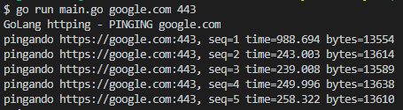

# scour-layer
Send request to seventh layer of the tcp stack

- [How to Use?](#How-to-use)

## How to Use

go run main.go -u(address to make as requisitions) -p(for HTTP use 80, for HTTPS 443)

    - Ex.: go run main.go -u google.com -p 443

