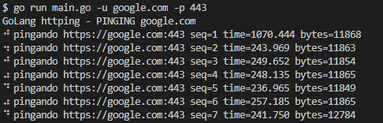

# scour-layer
Send request to seventh layer of the tcp stack

- [How to Use?](#How-to-use)

## How to Use

go run main.go -u(endereço para efetuar as requisições) -p(para HTTP use 80, para HTTPS 443)

    - Ex.: go run main.go -u google.com -p 443

